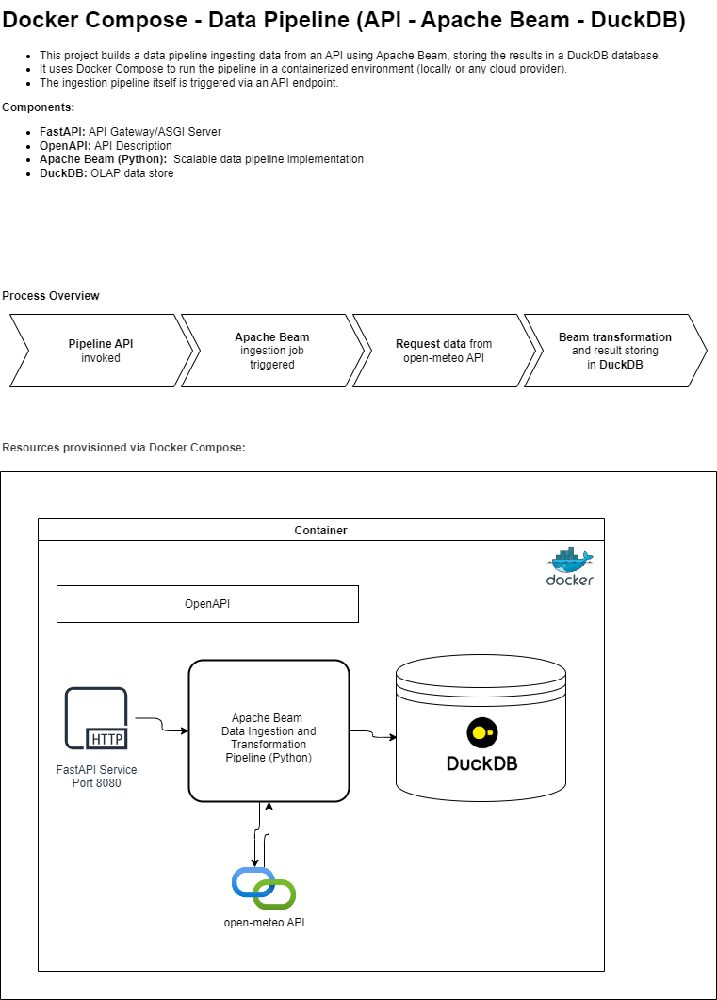

# dc-api-beam-duckdb: Docker Compose setup for API ingestion via Apache Beam into DuckDB  

This project builds a data pipeline ingesting data from an API using Apache Beam, storing the results in a DuckDB database.

It uses Docker Compose to run the pipeline in a containerized environment (locally or any cloud provider).
  
## Components:  
- **FastAPI**: API Gateway/ASGI Server
- **OpenAPI**: API Description
- **Apache Beam (Python)**:  Scalable data pipeline implementation
- **DuckDB**: OLAP database

## Requirements:  
 - see [Requirements.md](REQUIREMENTS.md)

## How to deploy and run:  
 - see [Execute.md](01_docker/EXECUTE.md)

  
## Architecture:  

