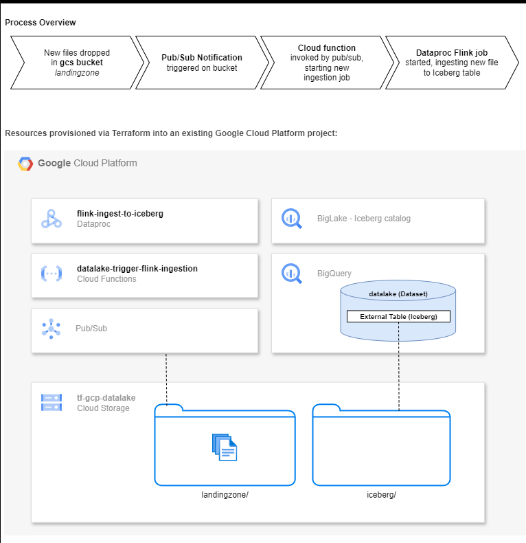

# tf-gcp-lakehouse: Terraform - GCP provisioning of Data Lakehouse  

This project builds a Data Lakehouse architecture with storage/compute separation using Apache Iceberg open storage format.  

It uses Cloud Functions + Cloud Dataproc + BigQuery/BigLake Iceberg for an event-driven architecture, leverageing GCP-native serverless services and Spark for scalable ingestion.  
  
## Components:  
- **GCS**: storage for raw data (landingzone) and Iceberg tables
- **Pub/sub** and **Cloud Function**: Trigger for ingestion jobs
- **Apache Spark (via Dataproc Serverless)**:  Ingests files and writes to Iceberg tables
- **BigQuery BigLake**: Iceberg catalog
- **BigQuery**: Query engine
  
  
## Architecture:  

